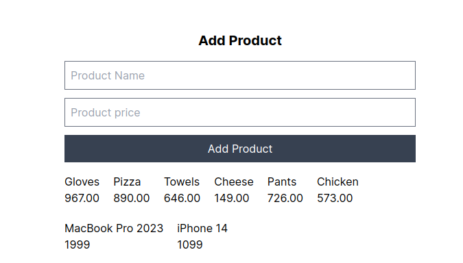

# Nextjs 13 Server Actions

We are exploring the practical use cases of Nextjs 13 Server Actions

## Clone this repo

You can work with the example code using the following command

```bash
git clone repo-name

```

Install the packages using the command

```bash
npm install
```

## Local Development

After installing the necessary packages you can run the local dev command

```bash
npm run dev
```

## Preview

Live preview of Server Actions creating products with an API endpoint.



### Resources used to learn about Server Actions

1. [Server Actions](https://nextjs.org/docs/app/building-your-application/data-fetching/server-actions)
2. [NextJS Docs - Data Fetching](https://nextjs.org/learn/)
3. [MockAPI](https://mockapi.io/)
